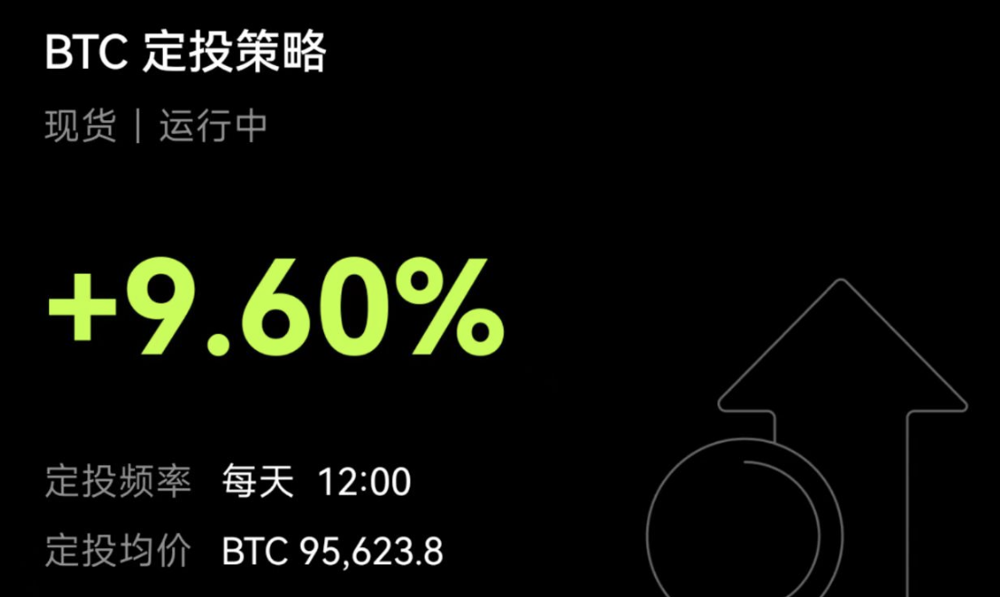

+++
date = '2025-05-20T20:11:52+08:00'
draft = true
title = '从学生到职场的初体验'

+++



# 前言

很久没写文章了，我也不知道写什么，距离上一次写文章已经过去好几个月，中间写毕业论文、到处投简历找工作、准备面试、背面试题。中间还进入对赚钱这个概念中个人觉得是一瞬间顿悟感觉的情况，目前还在逐步践行，知行合一还是蛮难的，这是一场和人性对抗挑战赛，充满了未知和诱惑，难以抵抗却又后知后觉，难以言表，特以此文书写最近的心态变化以及最近来到外地进入职场后的感受和相距家乡上千公里的风土人情。

那么我们按照时间线一点一点的拉拉家常

**注：技术文章我陆续会跟上，目前因为工作原因不方便写一些现在用到的思路和方法。对此，鄙人对上文给出的承诺倍感抱歉**

# 论文

先说一下笔者的学历背景，我的学历背景有点稍微特殊一点，专升本，对！就是那比半步巅峰的专科学历稍微强那么一丢丢的同时又比高考统考上本的垃圾那么一丢丢的两边阵营都不待见的专升本。所以，很难受。因为要在两年的时间内修满学分，所以当其他大三完后就可以出去实习的时候，我们专升本的还在吭呲吭呲的上大四，比较友好的是我们大四就上一学期，而且我们的大四第一学期最后一个月就开始论文的开题答辩了，对比其他朋友来说最后我们最后答辩的时间确实比他们快了不少，至少都要快了半个月。

说会正题，对于论文来说笔者这种学术垃圾肯定是写不出来什么好货的，那肯定是要借助新制生产力 `AI` 的帮助，笔者作为 `chatgpt` 的忠实粉丝几乎没用过其他 `AI` ，也不是说完全没用过，而是用惯了 `chatgpt` 用其他的也觉得也就那样吧，这里顺便提一嘴，笔者用 `mac book M3` 搭建了一个 `deepseek` 14B 还是 16B ，具体我忘了，反正就是不好用，我问一个问题起码得转圈圈30秒以上才回复给我，并且电脑非常的烫，笔者的 `mac` 是 `air` 没有风扇。

基本上靠着 `chatgpt` 写完了论文，后面学校通知要查 `AI` ，这就不得提到 `AI` 打败`AI` 了，当然了也并不是全是 `AI` 帮助写完了论文还有很多自己的想法和思路，同时作品部分也是通过 `cursor` 的帮助下完美的完成。

洋洋洒洒也没写几个字，因为我觉得对于普通高校的本科毕业论文来说主要还是看你态度端正与否，只要论文和作品不要太烂，能看着过得去，基本上老师还是很仁慈的，毕竟普通高校的大学生大家都心知肚明在大学学了些啥，即使确实学到了不少东西，但是就本科的层次来说做一个非常原创性的东西还是很难的，但是也并无可能。对大多数的普通高校毕业生而言还是完成就行，别太烂，态度端正。

# 钱

我之前一直很信没钱就得要梭哈得 `All in` ，慢慢的就发现这样还是不行，太年轻的想法，或者对于以前的我来说还是太不成熟，过于想当然。那么我是如何有改变的，其实也见得很难，就是在欧意交易所上去爆仓几次归零并且对自己的生活受到影响的时候，我发现这是一种对自己不负责的方式。

我如何做的？

第一步定投 `BTC` ，为什么定投这个，原因就是因为我相信。没有其他的，我相信就够了，其他的再多理由都是为了这个结果而找的。即使你反对你也能找到很多理由，所以没必要在这上面浪费精力和时间。我相信就足够。

第二步我选择了 `CSGO` 饰品市场。因为笔者最近一年左右也爱上了玩 `CSGO` ，对于投资来说，自己喜欢用的或者经常使用产品都可以考虑如何去投资，这里举一个例子，在二十万到三十万价位选一款车，最后能角逐出来的选择的产品然后再去看他背后的公司并从长期来看很少有不赚钱或者在股票市场表现不好的。例如：小米汽车、苹果公司等等。最终的最终这些产品的消费者买不买单才能决定这家企业能不能长久，而不是 `PPT` 写得有多好，发布会吹得有多牛。这些有用吗，还是有用，段时期有用，风头一过啥都得看产品是否过硬能不能获得消费者的青睐。到此我就说了我对长期定投的看法大致就如此，所以我选择 `CSGO` 饰品市场，因为我自己也玩的同时我还能出租，购买几百块的中低端产品，风险也能可控，对于租金我也测算过，年化率能超过 `10%` ，所以比银行的利息还是多不少。

# 工作

找工作别急，真的别急，再急也没用，写到这里其实我不想写了的，我想后面再来填坑，因为上班太累了我想休息。先留个坑，我这几天没天写点，把这篇文章完善必不会辜负所望
